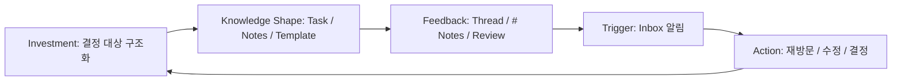
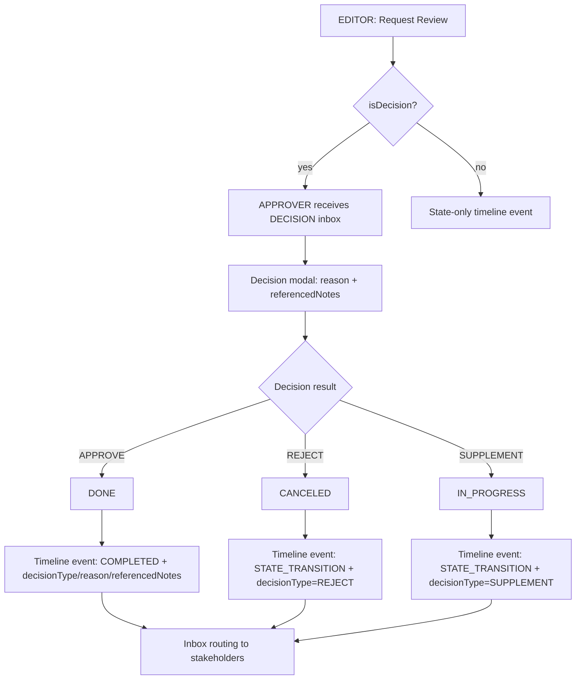
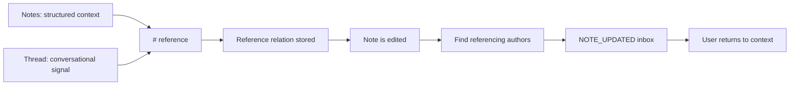
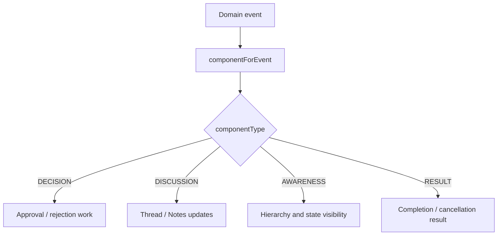
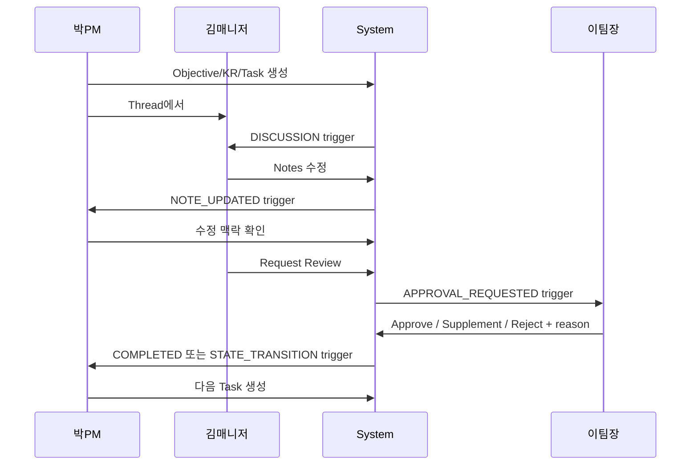
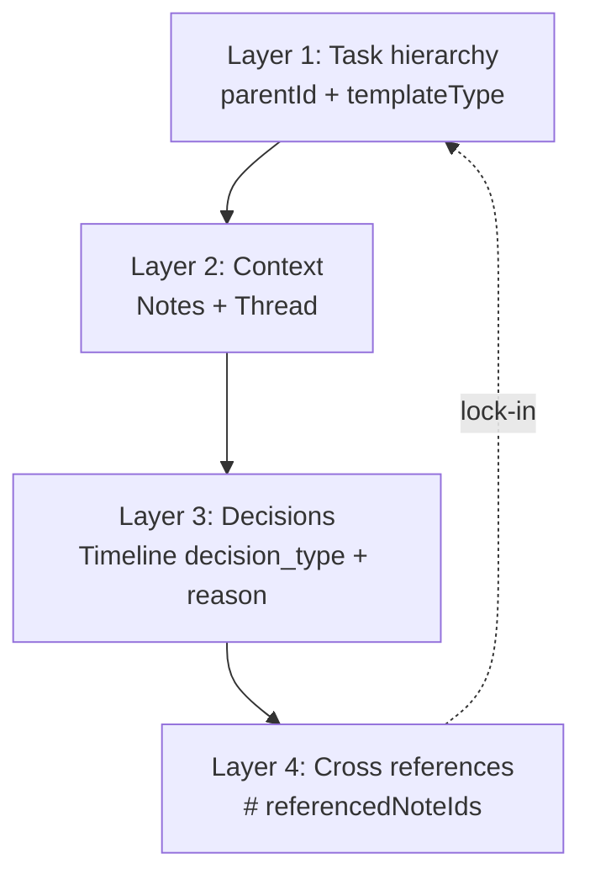

# SelvasIn4 HWE 액션 플로우

이 문서는 PRD의 액션 플로우 모델을 "구현 관점"으로 정리한 다이어그램 문서입니다.  
핵심 원칙은 단순히 태스크 결과를 쌓는 것이 아니라, 사용자 행동이 누적되어 `Decision Graph` 자산이 되도록 만드는 것입니다.

## 1. HWE Hook 루프

- Investment는 사용자가 남기는 구조, 맥락, 방법론 기여를 의미합니다.
- 알림이 "의미 있는 참여 신호"로 느껴질 때 루프가 건강하게 유지됩니다.
- 이 루프의 누적 결과물이 `Decision Graph`입니다.

## 2. 의사결정 액션 플로우

구현 제약:

- 서버가 역할/리소스 가시성을 강제 검증합니다.
- 상태 전이 시 `reason`은 필수입니다.
- `referencedNoteIds`는 "행위자에게 보이는 태스크"의 노트만 참조할 수 있습니다.
- 구현 기준 이벤트명은 `APPROVAL_REQUESTED`, `COMPLETED`, `STATE_TRANSITION`이며, 결정 의미는 `decisionType`으로 구분합니다.

## 3. 노트, 스레드, #참조 플로우

이 흐름은 Variable Reward 루프를 닫습니다.  
한 사용자가 맥락을 참조/수정해 투자하면, 다른 사용자는 과거 행동과 연결된 의미 있는 업데이트를 받게 됩니다.

## 4. Inbox 라우팅 플로우

구현 제약:

- 이벤트를 Inbox 컴포넌트로 분류하는 책임은 백엔드에 있습니다.
- 프론트의 탭은 서버가 분류한 Inbox 항목을 보여주는 뷰입니다.
- 공용 enum을 사용해 API/UI 간 분류 불일치를 방지합니다.

## 5. 2주 통합 플로우

파일럿에서는 "트리거 발생 -> 자발 행동 전환" 구간이 어디서 끊기는지를 집중 관찰해야 합니다.

## 6. Decision Graph 레이어

Decision Graph는 아래 레이어로 구성됩니다.

- 노드: Objective, KR, Task 및 템플릿 타입 단위
- 컨텍스트: 각 노드에 붙는 Notes와 Thread
- 결정: decision type, reason, note reference를 포함한 Timeline 이벤트
- 관계: `parentId`, `referencedNoteIds`, watchers, assignees, approvers

현재 UI의 `/graph` 라우트는 API 데이터 기반으로 위 4개 레이어를 시각화합니다.
