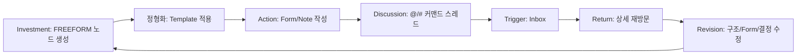
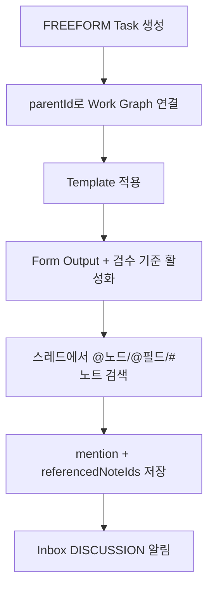
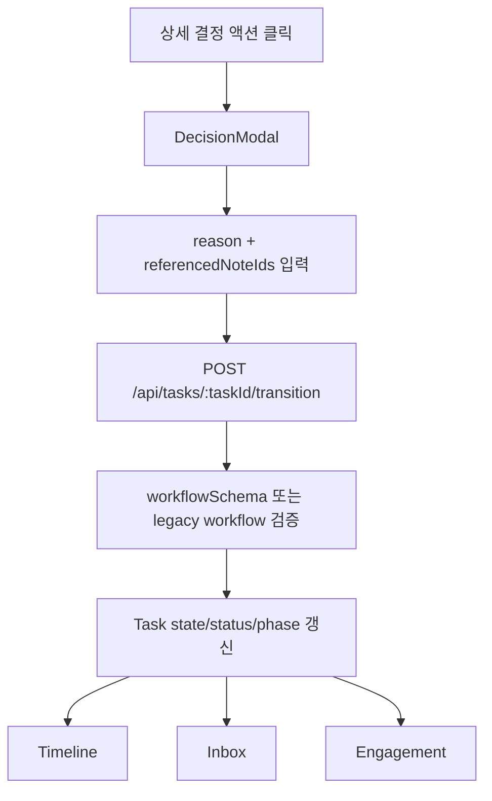
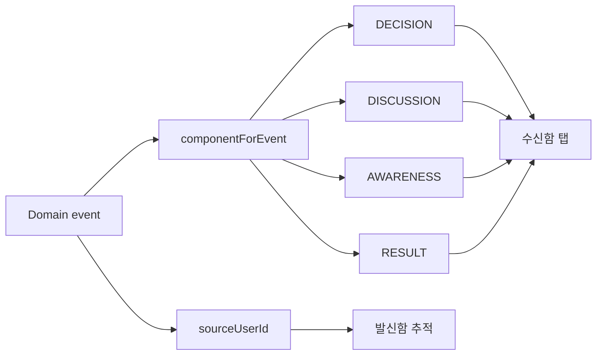

# SelvasIn4 HWE 액션 플로우

## Hook 루프



핵심은 사용자가 만든 구조와 맥락이 다음 재방문 이유가 되는 것입니다.

## 형상화 -> 정형화 -> 멘션



## 스레드 커맨드 플로우

```mermaid
flowchart LR
  A[Composer 입력] --> B{@ 또는 # 감지}
  B --> C[검색 메뉴 표시]
  C --> D[대상 선택]
  D --> E[본문 토큰 삽입]
  E --> F[mentions/referencedNoteIds 저장]
  F --> G[notifyMentions]
```

스레드 후보는 상시 칩으로 노출하지 않습니다. 채팅/문서 도구처럼 입력 중 커맨드 검색으로 호출합니다.

## 결정 전이 플로우



## 태스크 뷰 플로우

```mermaid
flowchart LR
  HOME[/home] --> A[/tasks]
  HOME --> J[결정 대기]
  HOME --> K[내 활성 태스크]
  HOME --> L[오늘/임박]
  A --> B[리스트]
  A --> C[보드]
  A --> D[백로그]
  A --> E[결정 그래프]
  B --> F[필터/정렬/그룹(폴더·리스트)]
  C --> G[상태별 이동]
  D --> H[스프린트 투입/WIP]
  E --> I[parent/note/decision edges]
```

## Inbox 라우팅


