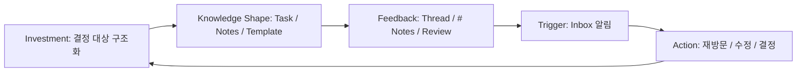
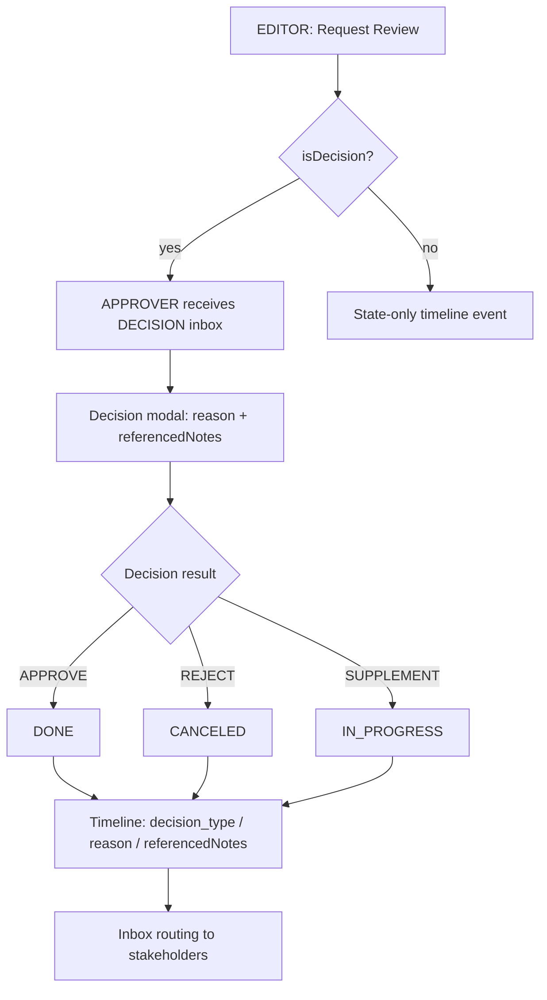
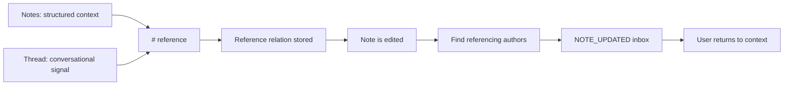
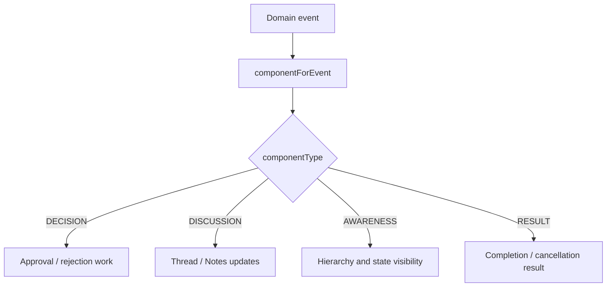
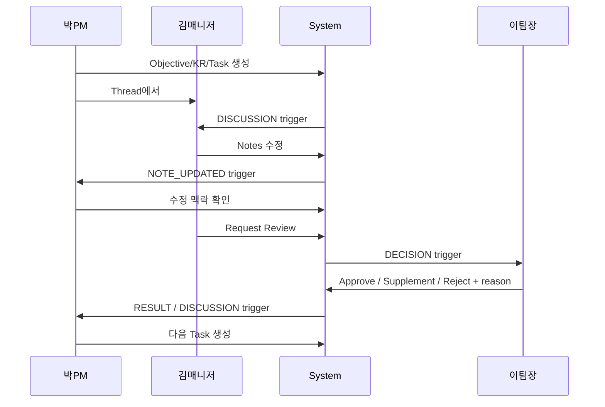
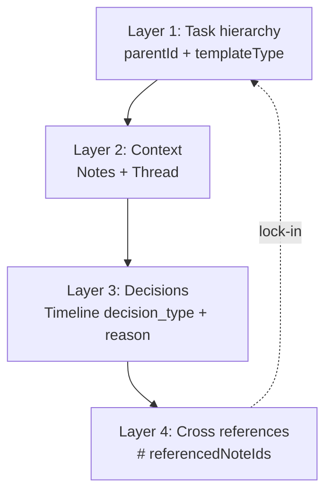

# SelvasIn4 HWE Action Flows

This document captures the PRD action-flow model as implementation-facing diagrams. The key product principle is that user actions must accumulate into a Decision Graph, not just produce isolated task outputs.

## 1. HWE Hook Loop

- Investment means structure, context, and methodology contributed by users.
- The loop is healthy only when alerts feel like meaningful participation signals.
- The accumulated asset is the Decision Graph.

## 2. Decision Action Flow

Implementation constraints:

- Server validates role and resource visibility.
- `reason` is required for transitions.
- `referencedNoteIds` can point to notes on any task visible to the acting user.

## 3. Notes, Thread, And # Reference Flow

This closes the Variable Reward loop: a user invests by referencing or editing context, and another user receives a meaningful update tied to a prior action.

## 4. Inbox Routing Flow

Implementation constraints:

- Backend owns event-to-component routing.
- Frontend tabs are views over server-classified inbox items.
- Shared enums prevent drift between API and UI.

## 5. Two-Week Integrated Flow

The pilot should watch where the transition from trigger to voluntary action fails.

## 6. Decision Graph Layers

Decision Graph is composed of:

- Nodes: Objective, KR, Task, and other template-typed units.
- Context: Notes and Thread attached to each node.
- Decisions: Timeline events with decision type, reason, and note references.
- Relations: `parentId`, `referencedNoteIds`, watchers, assignees, and approvers.

The UI route `/graph` visualizes the first four layers from current API data.
