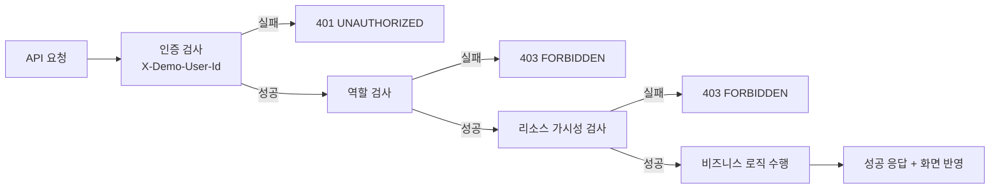

# 인증/권한/가시성 생애주기 가이드

## 이 문서의 목적

사용자 요청이 들어왔을 때 "누구인지 -> 권한이 있는지 -> 이 데이터를 볼 수 있는지"가 어떻게 판단되는지 단계별로 설명합니다.

## 한 문장 요약

모든 요청은 인증 -> 역할 검증 -> 리소스 가시성 검증을 통과해야 하며, 이 3단계가 실패하면 즉시 차단됩니다.

---

## 1) 인증 단계 (누구인가?)

입력:
- 헤더 `X-Demo-User-Id`

처리:
- 서버가 멤버 목록에서 사용자 조회
- 없으면 `401 UNAUTHORIZED`

의미:
- "로그인된 사용자 컨텍스트"를 먼저 확정

---

## 2) 권한 단계 (할 수 있는가?)

역할 계층:
- `VIEWER < EDITOR < APPROVER < ADMIN`

처리:
- 엔드포인트별 최소 역할 요구
- 부족하면 `403 FORBIDDEN`

예시:
- 생성/수정/삭제는 보통 `EDITOR` 이상
- 승인/반려 등은 `APPROVER` 이상

---

## 3) 가시성 단계 (볼 수 있는 대상인가?)

같은 역할이라도 "보이는 리소스"는 다를 수 있습니다.

처리:
- 사용자 기준 가시 태스크 집합 계산
- 대상 태스크가 집합 밖이면 `403 FORBIDDEN`

파급:
- 태스크 상세 조회 제한
- 노트 참조/멘션 대상 제한
- Inbox/그래프 노출 범위 제한

---

## 4) 비즈니스 액션 단계

위 3단계를 통과한 요청만 실제 변경 로직으로 들어갑니다.

예:
- 태스크 수정
- 상태 전이
- 댓글 작성

실패한 요청은 데이터 변경 없이 종료됩니다.

---

## 5) 응답/표현 단계

서버 응답:
- 성공 시 데이터 반환
- 실패 시 `error`, `requestId` 반환

프론트:
- `request()`에서 상태코드별 사용자 메시지 변환
- 권한 부족/입력 오류를 사용자에게 이해 가능한 문장으로 표시

---

## 6) 전체 흐름도

---

## 7) 왜 중요한가?

- 보안: 권한 없는 변경 차단
- 데이터 신뢰성: 보이면 안 되는 데이터 노출 방지
- 사용자 경험: 실패 이유를 일관되게 안내 가능

---

## 8) 공부 체크포인트

1. `apps/api/src/http/access.ts`의 `authenticate`, `requireRole`, `getVisibleTask`
2. `apps/api/src/server.ts`에서 각 라우트의 최소 권한 확인
3. `apps/web/src/lib/api.ts`의 에러 메시지 처리 확인
