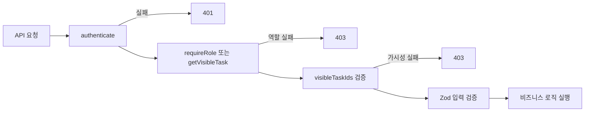

# 인증/권한/가시성 생애주기

## 한 문장 요약

모든 요청은 데모 인증, 역할 검증, 리소스 가시성 검증을 통과해야 하며, 노트 참조와 멘션도 같은 가시성 규칙을 따릅니다.

## 인증

- 입력: `X-Demo-User-Id`
- 구현: `authenticate`
- 미등록 사용자: `401 UNAUTHORIZED`
- `/health`만 public route입니다.

## 역할

현재 역할 순서:

```text
MEMBER < OWNER < ADMIN < SUPER_ADMIN
```

- `MEMBER`: 태스크 생성과 협업 행동 가능. 태스크 필드 수정은 별도 `canEditTask` 정책을 따름
- `OWNER`: 유닛 오너 맥락의 멤버십 관리 가능
- `ADMIN`: 전체 가시성과 관리 권한
- `SUPER_ADMIN`: ADMIN 이상 권한

역할 비교는 `isRoleAtLeast()`가 담당합니다.

## 태스크 가시성

`visibleTaskIdsFor(user)` 규칙:

- `ADMIN`, `SUPER_ADMIN`: 모든 task
- 그 외: `ownerId`, `assigneeIds`, `watcherIds`에 포함된 task
- 관련 task의 parent chain도 함께 포함

이 규칙은 task 상세, bootstrap, graph, note reference, mention 검증에 영향을 줍니다.

## Form 편집 권한

`canEditForm(user, task)`:

- `ADMIN`, `SUPER_ADMIN`: 가능
- task owner: 가능
- task assignee: 가능
- watcher/view-only 사용자는 제한

## 태스크 필드 수정 권한

`canEditTask(user, task)`:

- `ADMIN`, `SUPER_ADMIN`: 가능
- task owner: 가능
- task assignee: 가능
- 해당 task의 unit에서 `UnitMember.role=OWNER`인 사용자: 가능
- watcher 또는 parent chain으로만 보이는 사용자는 제한

이 정책은 `PATCH /api/tasks/:taskId`에서 `title`, `priority`, `assigneeIds`, `watcherIds`, `parentId`, `templateId`, `workflowStatusId`, `unitId`, `folderId`, `listId` 같은 태스크 필드 수정에 적용됩니다.

## Work Graph 순환 방지

`parentId` 변경 시 `wouldCreateTaskCycle()`로 새 parent chain을 검사합니다.

- 자기 자신을 parent로 지정할 수 없습니다.
- 자신의 descendant를 parent로 지정할 수 없습니다.
- 이미 손상된 순환 parent chain을 만난 경우에도 순회를 중단해 무한 루프를 피합니다.

## 멘션/참조 검증

`validateNoteRefs`:

- referencedNoteIds가 visible task의 note인지 확인합니다.

`validateMentions`:

- `MEMBER`: 존재하는 member인지 확인
- `NOTE`: visible task의 note인지 확인
- `TASK`: visible task인지 확인
- `FORM_FIELD`: visible task이면서 해당 `fieldKey`가 `formValues`에 존재하는지 확인

## 흐름도



## 읽을 코드

- `apps/api/src/http/access.ts`
- `apps/api/src/server.ts`
- `apps/web/src/lib/api.ts`
