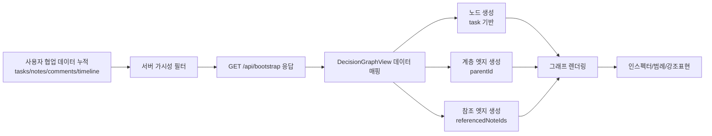

# Decision Graph 데이터 생애주기 가이드

## 이 문서의 목적

이 문서는 Decision Graph가 어떤 원천 데이터로 만들어지고, 서버/프론트를 거쳐 어떻게 시각화되는지 비개발자도 이해할 수 있게 설명합니다.  
핵심은 "그래프는 별도 DB가 아니라, 기존 업무 데이터의 조합 결과"라는 점입니다.

## 한 문장 요약

태스크(구조), 노트/댓글(맥락), 타임라인(결정), 참조관계(링크) 데이터를 서버에서 가져와 프론트가 그래프 노드/엣지로 재구성해 보여줍니다.

---

## 1) 데이터는 어디서 시작되나? (원천 데이터)

Decision Graph는 단일 테이블에서 오는 데이터가 아닙니다. 아래를 조합합니다.

- 태스크(`tasks`): 그래프의 기본 노드
- 노트(`notes`): 맥락 정보
- 댓글(`comments`): 논의 신호
- 타임라인(`timeline`): 결정/변경 이벤트
- 참조 정보(`referencedNoteIds`, 부모관계 `parentId`)

즉, 기존 협업 데이터가 누적되면 그래프가 자연스럽게 풍부해집니다.

---

## 2) 서버에서는 무엇을 해주나?

서버의 역할은 크게 2가지입니다.

1. 권한/가시성에 맞는 데이터만 반환  
2. 프론트가 그래프를 만들 수 있도록 필요한 원천 데이터를 제공

주요 조회 경로:
- 초기 로딩: `GET /api/bootstrap`
- 그래프 화면도 bootstrap 데이터 기반으로 렌더링

서버는 "그래프 좌표"를 직접 주기보다,  
그래프를 만들 재료(태스크/이벤트/참조)를 신뢰 가능하게 전달하는 데 집중합니다.

---

## 3) 프론트에서는 어떻게 그래프로 바꾸나?

프론트 `DecisionGraphView`에서 데이터를 해석해 그래프 요소를 만듭니다.

핵심 변환:
- 노드: 태스크 1개 = 그래프 노드 1개
- 계층 엣지: `parentId` 기반 연결
- 참조 엣지: 타임라인의 `referencedNoteIds` 기반 연결
- 시각 강조:
  - 결정 이벤트 수
  - 노트/댓글 밀도
  - 구조 상태(`FREEFORM`, `TEMPLATED`)

쉽게 말해,  
"업무 데이터 -> 시각 객체(노드/선/배지)" 변환이 프론트에서 일어납니다.

---

## 4) 데이터는 어디로 흘러가서 표현되나?

흐름:

1. API 응답으로 원천 데이터 수신
2. 그래프 뷰에서 필터링/매핑
3. SVG 기반 시각 요소 생성
4. 노드/엣지/인스펙터 패널로 렌더링

화면에서 사용자가 보는 것:
- 태스크 타입별 노드 색/스타일
- 상하위 관계선
- 참조 관계선(점선 등 시각 구분)
- 선택 노드의 상세 맥락(우측 인스펙터)

---

## 5) 전체 데이터 흐름

---

## 6) 예시 시나리오

예시: 팀원이 노트를 근거로 "검토 요청"을 했을 때

1. 태스크 전이 이벤트가 타임라인에 기록됨
2. `referencedNoteIds`에 근거 노트 연결
3. 그래프에서 해당 노드의 결정 신호가 증가
4. 근거 참조선이 생겨 "왜 이 결정이 나왔는지" 맥락이 보임

결과: 그래프가 단순 상태판이 아니라 "의사결정 근거 맵"으로 작동합니다.

---

## 7) 왜 중요한가?

- 업무 히스토리를 구조적으로 복기할 수 있음
- 근거 없는 결정과 근거 있는 결정을 시각적으로 구분 가능
- 신규 참여자가 맥락을 빠르게 따라잡을 수 있음

즉, Decision Graph는 협업 기억장치 역할을 합니다.

---

## 8) 공부 체크포인트

코드 읽기 순서 추천:

1. `apps/api/src/server.ts`의 `/api/bootstrap` 응답 범위 확인
2. `packages/shared/src/index.ts`의 `TimelineEvent`, `Task` 타입 확인
3. `apps/web/src/App.tsx`의 `DecisionGraphView` 데이터 매핑 확인
4. 그래프 엣지(계층/참조/결정) 생성 로직 비교

이 순서로 보면 "원천 데이터 -> 시각화 모델 -> 화면 표현"이 연결됩니다.
