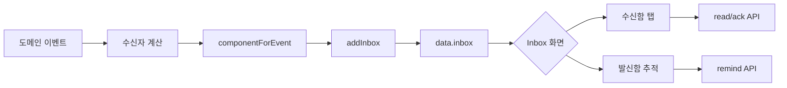

# Inbox 데이터 생애주기

## 한 문장 요약

Inbox는 협업 이벤트를 `DECISION`, `DISCUSSION`, `AWARENESS`, `RESULT`로 분류해 사용자에게 다음 행동 신호를 전달합니다.

## 생성 지점

Inbox는 주로 서버 이벤트 처리 중 생성됩니다.

- 결정 요청/승인/반려/보완
- 댓글 작성과 멘션
- 참조된 노트 수정
- 완료/취소 결과
- 구조 변경 또는 상태 가시성 변화

현재 인메모리 구현의 저장 함수는 `addInbox()`입니다. 운영 DB 전환 목표에서는 도메인 트랜잭션 안에서 Inbox/outbox record만 적재하고, 외부 push/email/analytics projection은 commit 이후 worker가 처리합니다.

## 분류

`componentForEvent()` 기본 분류:

- `DECISION`: `APPROVAL_REQUESTED`, `APPROVAL_APPROVED`, `APPROVAL_REJECTED`, `APPROVAL_SUPPLEMENT_REQUESTED`
- `DISCUSSION`: `COMMENT`, `MENTION`, `NOTE_UPDATED`, `NOTE_REFERENCED`
- `RESULT`: `COMPLETED`, `CANCELED`
- `AWARENESS`: `TASK_CREATED`, `STATE_TRANSITION`, `TASK_TRANSITIONED`, `HIERARCHY_CHANGE`, `TEMPLATE_APPLIED`, `TEMPLATE_REPLACED`, `TEMPLATE_REMOVED`, `TEMPLATE_SNAPSHOT_APPLIED` 등 상태/구조 인지 이벤트

## 수신자 계산

- 멘션된 MEMBER
- 멘션된 TASK/FORM_FIELD/NOTE의 owner, assignee, watcher
- 전이/결정 시 approval policy 기반 승인자
- 관련 task owner/assignee/watcher
- 보통 이벤트를 발생시킨 본인은 제외합니다.

## 상태 필드

- `readAt`: 읽음 여부
- `ackAt`: 확인 여부
- `remindCount`: 리마인드 횟수
- `sourceUserId`: 이벤트 발생자
- `mentionCommentId`: 멘션이 걸린 댓글

## API

- `GET /api/inbox?componentType=...`
- `PATCH /api/inbox/:itemId/read`
- `PATCH /api/inbox/:itemId/ack`
- `POST /api/inbox/:itemId/remind`
- `PATCH /api/inbox/read-all`

## 화면

Inbox 화면은 수신함/발신함 2열 구조입니다.

- 수신함: 현재 사용자(`userId === me`)에게 온 항목을 `DECISION`, `DISCUSSION`, `AWARENESS`, `RESULT` 탭으로 나누어 보여 줍니다. 현재 탭 모두 읽음과 전체 모두 읽음 액션은 수신함 기준입니다.
- 발신함: 현재 사용자가 발생시킨 항목(`sourceUserId === me`, `userId !== me`)을 추적합니다. 수신자 열람/미열람, SLA 초과, 리마인드 횟수, 대상 태스크를 표시합니다.

`/api/bootstrap`도 현재 사용자에게 관련된 Inbox를 포함합니다.

## 흐름도

