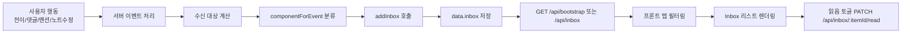

# Inbox 데이터 생애주기 가이드

## 이 문서의 목적

이 문서는 Inbox 데이터가 어떻게 만들어지고, 어떤 기준으로 분류되며, 사용자 화면에서 어떻게 소비되는지 비개발자도 이해할 수 있게 설명합니다.  
핵심은 "알림이 왜 왔는지"를 데이터 흐름 관점에서 이해하는 것입니다.

## 한 문장 요약

사용자 행동으로 도메인 이벤트가 발생하면, 서버가 수신 대상/컴포넌트 타입을 계산해 Inbox 항목을 만들고, 프론트가 이를 탭별로 보여주며 읽음 상태를 토글합니다.

---

## 1) 데이터는 어디서 시작되나? (발생 지점)

Inbox는 보통 아래 행동에서 시작됩니다.

- 상태 전이(검토 요청, 승인, 반려, 완료 등)
- 댓글 작성/멘션
- 노트 수정
- 구조 변경(부모 변경 등)

즉, "협업에 의미 있는 변화"가 발생했을 때 Inbox 후보가 생깁니다.

---

## 2) 서버에서 어떻게 생성되나? (생성 규칙)

서버는 특정 API 처리 중 Inbox 생성 함수를 호출합니다.

- 저장 함수: `addInbox(...)`
- 라우팅 보조: `componentForEvent(...)`

생성 시 들어가는 핵심 필드:
- `userId`: 누구에게 보낼지
- `taskId`: 어떤 태스크 맥락인지
- `componentType`: 어떤 종류의 알림인지
- `eventType`: 실제 이벤트 타입
- `title`, `message`: 사용자에게 보여줄 텍스트
- `readAt`: 읽음 여부 (`null`이면 미읽음)
- `createdAt`: 생성 시각

---

## 3) Inbox 분류는 어떻게 되나?

Inbox는 아래 4가지 컴포넌트로 분류됩니다.

- `DECISION`: 승인/반려/결정 관련
- `DISCUSSION`: 댓글/멘션/노트 업데이트 등 논의 관련
- `AWARENESS`: 구조/상태 가시성 관련
- `RESULT`: 완료/취소 등 결과 관련

중요한 점:
- 분류 책임은 서버에 있습니다.
- 프론트는 서버 분류 결과를 탭으로 보여주는 역할입니다.

---

## 4) 수신 대상은 어떻게 정해지나?

상황에 따라 다르지만, 일반적으로 아래 집합에서 계산됩니다.

- assignee
- watcher
- owner (필요 시)
- 승인 요청 시 APPROVER/ADMIN
- 멘션 대상 사용자

그리고 보통 "행동한 본인"은 수신 대상에서 제외합니다.

---

## 5) 어디에 저장되나?

현재는 인메모리 구조를 사용합니다.

- 저장 위치: `apps/api/src/domain/store.ts`의 `data.inbox`
- 생성 시점: 이벤트 처리 직후 즉시 추가

DB로 전환되더라도 개념은 동일합니다.  
"이벤트 -> 대상 계산 -> Inbox 생성" 규칙이 핵심입니다.

---

## 6) 프론트는 어떻게 호출하나?

호출 경로는 크게 2가지입니다.

1. 앱 초기/리로드 시 `GET /api/bootstrap`으로 Inbox를 포함해 한 번에 받음  
2. 읽음 토글 시 `PATCH /api/inbox/:itemId/read` 호출

프론트 공통 호출 함수 `request()`를 통해 서버와 통신합니다.

---

## 7) 화면에서는 어떻게 표현되나?

Inbox 화면은 컴포넌트 탭 기준으로 항목을 필터링해 보여줍니다.

- 탭: `DECISION`, `DISCUSSION`, `AWARENESS`, `RESULT`
- 표시 요소:
  - 제목(`title`)
  - 메시지(`message`)
  - 연결된 태스크 맥락
  - 생성 시간
  - 읽음/미읽음 상태

읽음 토글을 누르면 `readAt`이 `null <-> timestamp`로 바뀌고 UI가 즉시 반영됩니다.

---

## 8) 전체 데이터 흐름

---

## 9) 예시 시나리오

예시: "검토 요청"이 발생했을 때

1. EDITOR가 검토 요청 전이 실행
2. 서버가 결정 이벤트 생성
3. APPROVER/ADMIN 대상 Inbox(`DECISION`) 생성
4. 사용자 Inbox 탭에 검토 요청 항목 표시
5. 사용자가 열람 후 읽음 토글

결과적으로 Inbox는 "해야 할 다음 행동"을 사용자에게 정확히 전달하는 통로가 됩니다.

---

## 10) 공부 체크포인트

코드 읽기 순서 추천:

1. `apps/api/src/server.ts`에서 `addInbox` 호출 지점 확인
2. `apps/api/src/domain/store.ts`의 `addInbox`, `componentForEvent` 확인
3. `apps/web/src/App.tsx`의 `InboxView` 확인
4. `PATCH /api/inbox/:itemId/read` 호출과 UI 반영 확인

이 순서로 보면 "이벤트 -> 분류 -> 수신 -> 표시 -> 상태변경"이 한 번에 연결됩니다.
