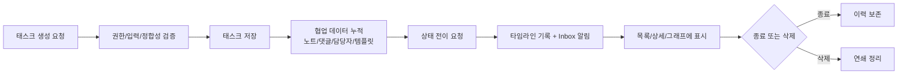

# 태스크 데이터 생애주기 가이드

## 이 문서의 목적

태스크가 생성되어 협업되고, 상태가 바뀌고, 필요 시 삭제되기까지의 전체 흐름을 비개발자 기준으로 설명합니다.

## 한 문장 요약

태스크는 생성 -> 맥락 확장(노트/댓글/담당자) -> 상태 전이(결정) -> 기록(타임라인/Inbox) -> 종료/삭제 흐름으로 생애주기를 가집니다.

---

## 1) 생성 단계

시작점:
- 사용자가 태스크 생성 API 호출 (`POST /api/tasks`)

서버에서 하는 일:
- 권한 확인 (`EDITOR` 이상)
- 입력 검증 (title 등)
- `unitId/folderId/listId` 정합성 검증
- 태스크 저장
- 타임라인 `TASK_CREATED` 기록

---

## 2) 작업 확장 단계

생성 후 태스크는 아래 데이터가 붙으면서 풍부해집니다.

- 담당자/참여자: `assigneeIds`, `watcherIds`
- 맥락: 노트(`notes`), 댓글(`comments`)
- 구조: `parentId` (상하위 연결)
- 템플릿: `templateId`, `formValues`

이 단계에서 실질적인 협업 데이터가 쌓입니다.

---

## 3) 상태 전이 단계

대표 상태:
- `DRAFT` -> `IN_PROGRESS` -> `PENDING_APPROVAL` -> `DONE`/`CANCELED`

전이 호출:
- `POST /api/tasks/:taskId/transition`

전이 시 필수 요소:
- `reason` (결정 사유)
- 필요 시 `referencedNoteIds` (근거 노트)

결과:
- 타임라인에 결정 이벤트 추가
- 이해관계자 Inbox 알림 생성

---

## 4) 조회/표현 단계

프론트는 아래 경로로 태스크 데이터를 조회합니다.

- 초기: `GET /api/bootstrap`
- 상세: `GET /api/tasks/:taskId`

표현 위치:
- 태스크 목록/보드/백로그
- 태스크 상세(시스템 필드, 노트, 스레드, 타임라인)
- Decision Graph 노드

---

## 5) 종료/삭제 단계

종료:
- 상태를 `DONE` 또는 `CANCELED`로 전이
- 기록/알림은 남아 추적 가능

삭제:
- `DELETE /api/tasks/:taskId`
- 하위 태스크/연결 데이터까지 연쇄 정리(cascade)

---

## 6) 전체 흐름도

---

## 7) 공부 체크포인트

1. `POST /api/tasks` 생성 검증
2. `PATCH /api/tasks/:taskId` 부분 수정 규칙
3. `POST /api/tasks/:taskId/transition` 전이 규칙
4. 상세 응답(`task + notes + comments + timeline`) 구조 이해
