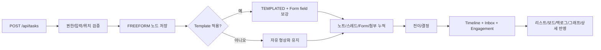

# 태스크 데이터 생애주기

## 한 문장 요약

태스크는 Work Graph 노드로 생성되어 `FREEFORM` 형상화 상태에서 시작할 수 있고, Template 적용으로 `TEMPLATED` 정형화 상태가 되며, 노트/스레드/타임라인/Inbox/Analytics와 연결됩니다.

## 1. 생성

진입점:

- `/tasks` 리스트/보드/백로그 뷰의 생성 폼
- 계층형 노드 생성
- `POST /api/tasks`

서버 처리:

- `MEMBER` 이상 역할 확인
- `unitId`, `folderId`, `listId` 정합성 검증
- `templateId`, `approvalPolicyId` 유효성 검증
- Task 저장
- Template/Form/Workflow/ApprovalPolicy를 생성 시점 snapshot으로 고정
- `TASK_CREATED` 타임라인 생성
- Template이 있으면 `TEMPLATE_SNAPSHOT_APPLIED` 타임라인 생성
- `NODE_CREATED` engagement 생성
- Template이 있으면 Form field 누락분 보강(기존값 보존)과 `TEMPLATE_APPLIED` engagement 생성

## 2. 형상화와 정형화

- `structureState=FREEFORM`: 이름, 관계, 설명 중심의 자유 노드
- `structureState=TEMPLATED`: Template이 적용되어 `formDefinition`, `inspectionCriteria`, workflow가 활성화된 노드
- `PATCH /api/tasks/:taskId`에서 `templateId`를 지정하면 `applyTemplate()`이 실행됩니다.
- Task는 `templateId`만 바라보지 않고 `templateSnapshot`, `formSnapshot`, `workflowSnapshot`, `approvalPolicySnapshot`을 함께 보관합니다.
- Template이 이후 수정되어도 기존 Task 실행 해석은 snapshot 기준으로 유지됩니다.

## 3. 배치와 분류

태스크는 아래 맥락을 가집니다.

- `unitId`: 업무 단위
- `folderId`: 유닛 안의 폴더
- `listId`: 리스트
- `parentId`: Work Graph 계층
- `workflowPhase`: `BACKLOG`, `PLAN`, `ACTIVE`, `CLOSED`
- `phaseOverride`: UI에서 명시적으로 phase를 바꿀 때 사용
- `workflowStatusId`: workflowSchema의 status id

`parentId` 변경은 cycle을 만들 수 없습니다. 자기 자신이나 descendant를 parent로 지정하면 `INVALID_PARENT`로 차단됩니다.

## 4. 협업 확장

태스크 상세에서 붙는 데이터:

- `notes`: 결정 근거와 파일/링크 맥락
- `comments`: 스레드
- `mentions`: `@` 커맨드로 선택한 사람/노드/Form 필드
- `referencedNoteIds`: `#` 커맨드로 선택한 노트
- `attachments`: 파일/링크 첨부
- `formValues`: Template 기반 산출물 필드 값

## 5. 전이와 결정

전이/승인 API:

- `POST /api/tasks/:taskId/transitions`: 승인 없는 일반 상태 전이
- `POST /api/tasks/:taskId/approval-requests`: 승인 요청 생성
- `POST /api/approval-requests/:approvalRequestId/decisions`: 승인/반려/보완요청 처리
- `POST /api/tasks/:taskId/transition`: legacy compatibility

전이 조건:

- `reason` 필수
- `referencedNoteIds`는 visible task 범위 안의 노트만 허용
- `approvalPolicyId`가 있으면 유효한 enabled policy여야 함
- Template의 `workflowSchema.transitions`가 있으면 해당 규칙을 우선 사용
- 열린 `ApprovalRequest`가 있으면 새 승인 요청은 `409 APPROVAL_ALREADY_PENDING`으로 거절
- `PENDING_APPROVAL`은 문자열 추측이 아니라 열린 `ApprovalRequest` 존재 여부로 판단

결과:

- Task state/status/phase 갱신
- Timeline 이벤트 생성
- 관련 수신자 Inbox 생성
- `DECISION_TRANSITION` engagement 생성
- 상태 전이/승인 이벤트 payload에는 template/workflow/form snapshot 참조 시점이 남음

## 6. 조회와 표현

- `/api/bootstrap`: 현재 사용자 visible task 범위 기준 초기 데이터
- `/api/tasks/:taskId`: 상세 데이터, visible children, referenceable tasks/notes, `workflowRuntime`, `activeApprovalRequest`, `availableActions`, `permissions` 포함
- 화면:
  - `/home`: 결정 대기, 내 활성 태스크, 임박 항목, 참관 업데이트 요약
  - `/tasks`: 리스트/보드/백로그/결정 그래프 탭
  - `/tasks/:taskId`: 상세 워크스페이스
  - `/graph`: 그래프 전용 경로

## 7. 삭제

- `DELETE /api/tasks/:taskId`
- 하위 task, notes, comments, timeline, inbox, attachments를 cascade로 정리합니다.

## 흐름도

