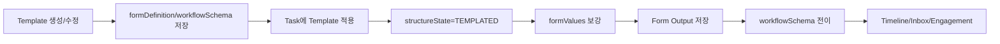

# Template 데이터 생애주기

## 한 문장 요약

Template은 자유 형상화된 Work Graph 노드를 `TEMPLATED` 상태로 정형화하고, Form Output, 검수 기준, workflow 전이를 활성화하는 기준 데이터입니다.

## 1. 생성과 관리

진입점:

- `POST /api/templates`
- `PATCH /api/templates/:templateId`
- `PATCH /api/templates/:templateId/workflow`
- `DELETE /api/templates/:templateId`

Template 핵심 필드:

- `type`: `VISION`, `AXIS`, `OBJECTIVE`, `KEYRESULT`, `TASK`
- `enabled`: 사용 가능 여부
- `formDefinition`: Form Output 필드 정의
- `inspectionCriteria`: 검수 기준
- `workflow`: legacy state 전이
- `workflowSchema`: status 기반 전이와 approval gate

## 2. 태스크 적용

적용 지점:

- `POST /api/tasks`에서 `templateId`를 포함해 생성
- `PATCH /api/tasks/:taskId`에서 `templateId` 지정

서버 처리:

1. Template 존재 여부와 enabled 상태를 확인합니다.
2. 태스크의 `templateId`, `templateType`, `structureState`를 갱신합니다.
3. `structureState=TEMPLATED`로 전환합니다.
4. `formValues`는 기존 값을 보존하고 `formDefinition` 배열의 field key 누락분을 보강합니다.
5. `templateSnapshot`, `formSnapshot`, `workflowSnapshot`, `approvalPolicySnapshot`을 적용 시점 기준으로 고정합니다.
6. `TEMPLATE_APPLIED` engagement event와 `TEMPLATE_SNAPSHOT_APPLIED` 타임라인 이벤트를 생성합니다.

## 3. Form Output 저장

Form Output은 임의 key/value가 아니라 적용된 Template의 `formDefinition`을 기준으로 저장됩니다.

- 프론트는 `formDefinition`으로 입력 UI를 렌더링합니다.
- 서버는 `PATCH /api/tasks/:taskId`의 `formValues`를 처리합니다.
- Form 저장은 `FORM_SAVED` engagement event로 분석에 반영됩니다.

## 4. 전이와 결정

전이/승인 API:

- `POST /api/tasks/:taskId/transitions`
- `POST /api/tasks/:taskId/approval-requests`
- `POST /api/approval-requests/:approvalRequestId/decisions`
- `POST /api/tasks/:taskId/transition` (legacy compatibility)

전이 규칙:

- `workflowSchema.transitions`가 있으면 status 기반 전이를 우선합니다.
- `workflowSchema`가 없거나 해당 전이가 없으면 legacy `workflow`를 사용합니다.
- 전이 요청은 `reason`을 필요로 합니다.
- `onExit.approvalGate`가 있으면 승인정책과 Inbox 수신자 계산에 연결됩니다.
- 승인 요청은 `ApprovalRequest.policySnapshot`에 요청 시점 정책을 고정하고, 열린 요청이 있으면 중복 요청을 차단합니다.

## 5. 조회와 표현

- `/api/bootstrap`: visible task와 함께 templates를 반환합니다.
- `/api/templates`: Template 목록을 반환합니다.
- 태스크 상세: Form Output과 검수 기준을 보여줍니다.
- 결정 액션 바: 상세 응답의 `workflowRuntime`/`availableActions`를 기반으로 가능한 액션을 보여줍니다.

## 흐름도

## 읽을 코드

- `packages/shared/src/index.ts`: `Template`, `FormFieldDefinition`, `WorkflowStatusDefinition`
- `apps/api/src/server.ts`: template CRUD, task template 적용, transition/approval 처리
- `apps/api/src/domain/store.ts`: engagement와 task 직렬화
- `apps/web/src/pages/settings/SettingsPages.tsx`: Template 관리
- `apps/web/src/pages/TaskDetailPage.tsx`: Form Output, 결정 액션 UI
