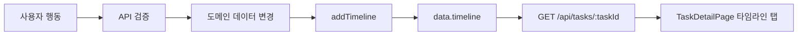

# 타임라인 데이터 생애주기

## 한 문장 요약

타임라인은 태스크에서 발생한 생성, 필드 수정, 구조 변경, 노트 변경, 전이/결정 이벤트를 저장하고, 태스크 상세 우측 `타임라인` 탭에서 보여주는 감사 로그입니다.

## 발생 지점

대표 생성 지점:

- `POST /api/tasks`: `TASK_CREATED`
- `PATCH /api/tasks/:taskId`: `STATE_TRANSITION`, `HIERARCHY_CHANGE`, `TEMPLATE_APPLIED/REPLACED/REMOVED`
- `POST /api/tasks/:taskId/transitions`: `TASK_TRANSITIONED`, `COMPLETED`, `CANCELED`
- `POST /api/tasks/:taskId/approval-requests`: `APPROVAL_REQUESTED`
- `POST /api/approval-requests/:approvalRequestId/decisions`: `APPROVAL_APPROVED`, `APPROVAL_REJECTED`, `APPROVAL_SUPPLEMENT_REQUESTED`
- `POST /api/tasks/:taskId/transition`: legacy compatibility
- `POST/PATCH/DELETE note`: `NOTE_UPDATED`

현재 구현에서 comment 작성/수정/삭제는 Timeline event를 만들지 않습니다. 댓글과 멘션은 Inbox와 Engagement, Decision Graph 참조 신호에 반영됩니다.

## 저장 구조

`TimelineEvent` 핵심 필드:

- `taskId`
- `type`
- `actorId`
- `decisionType`
- `reason`
- `referencedNoteIds`
- `payload`
- `createdAt`

저장은 `apps/api/src/domain/store.ts`의 `data.timeline`이며, `addTimeline()`이 최신 이벤트를 앞에 추가합니다.

## Snapshot Reference 원칙

타임라인은 감사 로그이므로 이벤트 발생 당시의 근거를 복원할 수 있어야 합니다. 운영 DB 전환 시 payload는 본문 전체 복사보다 `id + version` 참조를 우선합니다.

- Note 근거: `noteId + noteVersionId`
- Form Output 근거: `formOutputVersionId`
- 승인 근거: `approvalRequestId + approvalDecisionId`
- Template/Workflow 근거: `templateVersionId + workflowVersionId`

Note 버전 모델이 아직 없을 때는 차선책으로 `noteId + noteContentSnapshot`을 남깁니다. 화면은 snapshot을 보여주고, 클릭은 현재 Note로 이동하게 합니다.

## 표현 위치

- 태스크 상세 우측 패널의 `타임라인` 탭
- `/api/tasks/:taskId` 상세 응답의 `timeline`
- 프론트 상세 우측 탭에서는 사용자에게 `변경 기록`으로 표시됩니다.
- `/api/bootstrap`의 visible task 범위 timeline

현재 상세 우측 패널은 `스레드`와 `타임라인`을 탭으로 전환합니다. 탭 상태는 `rt=timeline` query로 유지됩니다.

## UI 동작

- 이벤트 타입별 라벨을 표시합니다.
- actor, decisionType, reason, note reference를 함께 보여줍니다.
- 같은 actor가 같은 minute에 남긴 로그는 세션으로 묶습니다.
- `전체 펼침/접기` 버튼으로 숨은 세션 로그를 제어합니다.

## 흐름도

## 읽을 코드

- `apps/api/src/domain/store.ts`: `addTimeline`
- `apps/api/src/server.ts`: `addTimeline` 호출 지점
- `apps/web/src/pages/TaskDetailPage.tsx`: `TaskRightPanel`, `TimelinePanel`
