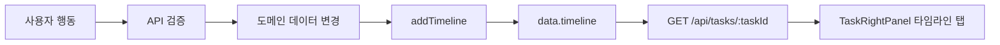

# 타임라인 데이터 생애주기

## 한 문장 요약

타임라인은 태스크에서 발생한 생성, 수정, 구조 변경, 노트 변경, 전이/결정 이벤트를 저장하고, 태스크 상세 우측 `타임라인` 탭에서 보여주는 감사 로그입니다.

## 발생 지점

대표 생성 지점:

- `POST /api/tasks`: `TASK_CREATED`
- `PATCH /api/tasks/:taskId`: `STATE_TRANSITION` 또는 `HIERARCHY_CHANGE`
- `POST /api/tasks/:taskId/transition`: `APPROVAL_REQUESTED`, `COMPLETED`, `STATE_TRANSITION`
- `POST/PATCH/DELETE note`: `NOTE_UPDATED`
- `POST/PATCH/DELETE comment`: `COMMENT`, `MENTION`

## 저장 구조

`TimelineEvent` 핵심 필드:

- `taskId`
- `type`
- `actorId`
- `decisionType`
- `reason`
- `referencedNoteIds`
- `payload`
- `createdAt`

저장은 `apps/api/src/domain/store.ts`의 `data.timeline`이며, `addTimeline()`이 최신 이벤트를 앞에 추가합니다.

## 표현 위치

- 태스크 상세 우측 패널의 `타임라인` 탭
- `/api/tasks/:taskId` 상세 응답의 `timeline`
- `/api/bootstrap`의 visible task 범위 timeline

현재 상세 우측 패널은 `스레드`와 `타임라인`을 탭으로 전환합니다. 탭 상태는 `rt=timeline` query로 유지됩니다.

## UI 동작

- 이벤트 타입별 라벨을 표시합니다.
- actor, decisionType, reason, note reference를 함께 보여줍니다.
- 같은 actor가 같은 minute에 남긴 로그는 세션으로 묶습니다.
- `전체 펼침/접기` 버튼으로 숨은 세션 로그를 제어합니다.

## 흐름도

## 읽을 코드

- `apps/api/src/domain/store.ts`: `addTimeline`
- `apps/api/src/server.ts`: `addTimeline` 호출 지점
- `apps/web/src/App.tsx`: `TaskRightPanel`, `TimelinePanel`
