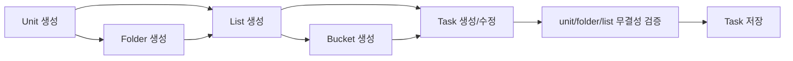

# Workspace 데이터 생애주기

## 한 문장 요약

Workspace 맥락은 `Unit -> Folder -> List -> Bucket -> Task`로 이어지며, 태스크 생성/수정 시 `unitId`, `folderId`, `listId` 조합 무결성을 서버가 강제합니다.

프론트의 `Shell` Explorer는 동일한 계층을 시각화합니다. Microsoft Teams의 팀/채널 메타포는 **IA 스케치용 참고**이며, 도메인 용어는 Unit/Folder/List이고 리스트 행은 스레드의 노트 커맨드 `#`과 겹치지 않도록 별도 아이콘으로 표시합니다.

## 1. Unit

API:

- `GET /api/units`
- `POST /api/units`
- `PATCH /api/units/:unitId`
- `DELETE /api/units/:unitId`
- `PATCH /api/units/:unitId/members/:memberId`
- `DELETE /api/units/:unitId/members/:memberId`

Unit은 업무 단위의 최상위 컨텍스트입니다.

- `name`: 단위 이름
- `purpose`: 단위 목적
- `defaultApprovalPolicyId`: 기본 승인정책
- `notificationConfig`: 단위 알림 설정

Unit 삭제는 하위 folder, list, task, unit member가 없어야 가능합니다.

## 2. Folder / List

API:

- `GET /api/folders?unitId=...`
- `POST /api/folders`
- `GET /api/lists?unitId=...`
- `POST /api/lists`
- `PATCH /api/lists/:listId`

Folder는 unit 안의 문맥 묶음이고, List는 태스크가 실제로 배치되는 작업 목록입니다.

- `Folder.unitId`는 소속 unit을 가리킵니다.
- `TaskList.unitId`는 소속 unit을 가리킵니다.
- `TaskList.folderId`는 선택적 folder 컨텍스트입니다.
- `TaskList.defaultPhase`는 새 태스크의 기본 workflow phase로 사용할 수 있습니다.

## 3. Bucket

API:

- `GET /api/buckets?unitId=...&listId=...`
- `POST /api/buckets`
- `PATCH /api/buckets/:bucketId`
- `DELETE /api/buckets/:bucketId`

Bucket은 계층이나 상태가 아니라 실행 큐를 나누는 보조 운영 축입니다.

- `unitId`: 특정 unit 또는 전역 bucket
- `listId`: 특정 list 또는 공통 bucket
- `order`: 표시 순서

Bucket 삭제 시 연결된 태스크의 `bucketId`는 `null`로 정리되며, 태스크 삭제나 상태 전이를 유발하지 않습니다.

## 4. 태스크 배치 검증

태스크 생성/수정 API:

- `POST /api/tasks`
- `PATCH /api/tasks/:taskId`

서버 검증:

- `unitId`는 존재해야 합니다.
- `listId`는 존재하고 해당 `unitId`에 속해야 합니다.
- `folderId`가 있으면 존재하고 해당 `unitId`에 속해야 합니다.
- `folderId`와 `listId`가 함께 있으면 같은 컨텍스트여야 합니다.
- 조합이 맞지 않으면 `FOLDER_LIST_MISMATCH`로 저장 전에 차단합니다.

## 5. 화면 표현

- `Shell` Explorer: 동일 unit 내에서 folder·list를 트리로 전환(팀즈 팀/채널 UI는 **참고 IA**); list 행에 `#`는 쓰지 않음.
- 태스크 리스트: unit, folder, list, bucket 필터와 메타 정보를 표시합니다.
- 보드/백로그: list와 phase, bucket 맥락을 함께 사용합니다.
- 결정 그래프: workspace 맥락은 그래프 노드의 운영 메타데이터로 사용됩니다.
- 설정/관리: unit, member, permission, approval policy를 관리합니다.

## 흐름도

## 읽을 코드

- `packages/shared/src/index.ts`: `Unit`, `UnitMember`, `Folder`, `TaskList`, `Bucket`, `Task`
- `apps/api/src/server.ts`: workspace API와 task 배치 검증
- `apps/api/src/domain/store.ts`: workspace seed data와 직렬화
- `apps/web/src/App.tsx`: URL `?unit` / `?list`·bootstrap·Shell 위임
- `apps/web/src/layout/Shell.tsx` · `components/WorkspaceSurfaceIcons.tsx`: GNB, Unit/Folder/List Explorer(채널 `#` 미사용)
- `apps/web/src/pages/*` · `features/tasks/*`: 본문 화면·태스크 뷰
