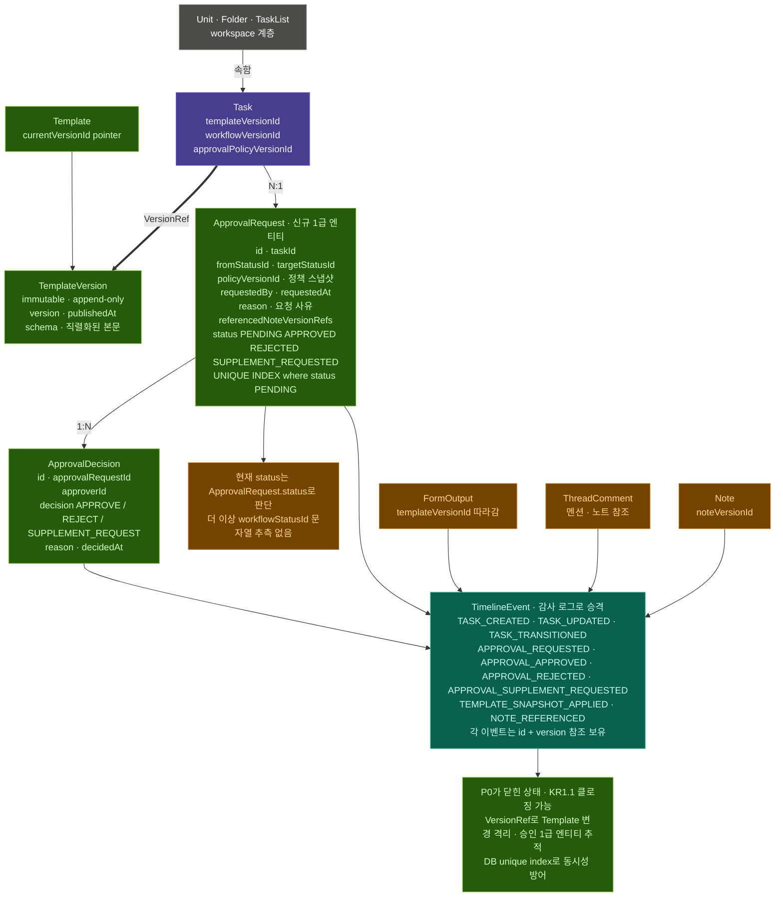
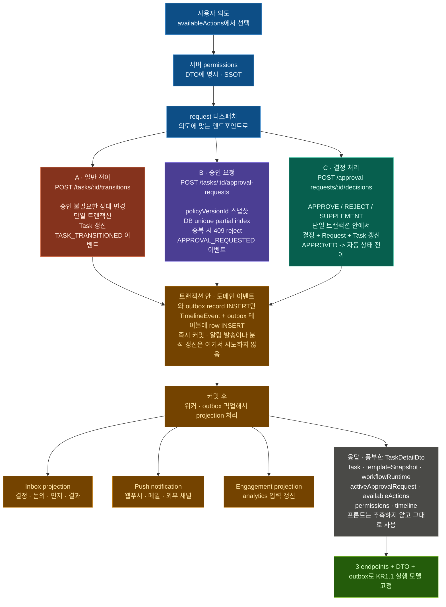
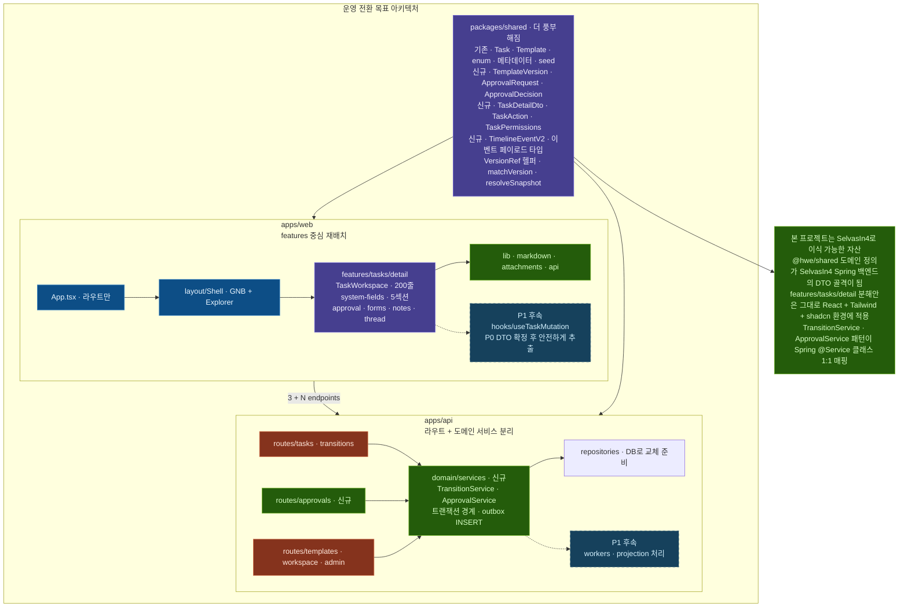

# KR 1.1 구현 플랜 — 전환 정책 커버 실행안

## 목적

| 항목 | 내용 |
| --- | --- |
| 기준 문서 | `KR1_1_TRANSITION_POLICY_DECISION.md` (KR11-TP-v1) |
| 목표 | FREEFORM/TEMPLATED 전환 정책(B안 안전 매핑)을 코드/UX/지표에 반영 |
| 완료 정의 | 수용 기준 TP-AC-01 ~ TP-AC-04를 코드/테스트/문서로 충족 |

## 구현 범위

| 트랙 | 범위 |
| --- | --- |
| API | 상태 매핑, 정책 재검증, 에러 코드, 이벤트 스키마 |
| Web | 전환 안내 UX, 불일치 경고, 상태/정책 가시화 |
| Shared | 타입 확장(이벤트/응답/검증 메타) |
| Analytics | 매핑 성공률/수동 보정률/전환 이벤트 지표 |
| Docs | 정책-구현-검증 결과 동기화 |

## 우선순위 실행 (P1 -> P4)

### P1. 서버 전환 엔진 구현

| 항목 | 상세 |
| --- | --- |
| 목표 | 템플릿 변경 시 `workflowStatusId` 안전 매핑 및 검증 강제 |
| 대상 파일 | `apps/api/src/server.ts`, `apps/api/src/domain/store.ts` |
| 작업 | 1) 카테고리 기반 상태 매핑 함수 추가 2) fallback 규칙 적용 3) 실패 시 `WORKFLOW_STATUS_MAPPING_REQUIRED` 반환 |
| 산출물 | 템플릿 적용/교체/해제 시 유효 상태 보장 |

### P2. 승인정책 정합성 처리

| 항목 | 상세 |
| --- | --- |
| 목표 | 템플릿 교체 시 승인정책 자동 재선정 없이 유효성 재검증 |
| 대상 파일 | `apps/api/src/server.ts`, `packages/shared/src/index.ts` |
| 작업 | 1) `approvalPolicyId` 유효성 재검증 2) 불일치 경고 메타 생성 3) 전이 시점 안전 차단 유지 |
| 산출물 | 정책 불일치가 누락되지 않고 사용자에게 명시 |

### P3. 전환 UX + 타임라인 이벤트

| 항목 | 상세 |
| --- | --- |
| 목표 | 사용자가 전환 결과(매핑/경고)를 즉시 이해하고 추적 가능 |
| 대상 파일 | `apps/web/src/pages/TaskDetailPage.tsx`, `apps/web/src/lib/domain.ts` |
| 작업 | 1) 템플릿 전환 결과 배지/토스트 2) 정책 재검토 필요 경고 3) 이벤트 타입(`TEMPLATE_APPLIED/REPLACED/REMOVED`) 표시 |
| 산출물 | 적용/교체/해제 구분 추적 가능 |

### P4. 지표/회귀/문서 동기화

| 항목 | 상세 |
| --- | --- |
| 목표 | 운영 지표와 회귀 테스트로 정책 준수 보장 |
| 대상 파일 | `apps/api/src/domain/store.ts`, `apps/web/src/pages/AnalyticsPage.tsx`, `docs/OKR_MATCHING_REPORT.md` |
| 작업 | 1) 매핑 성공률/수동 보정률 계산 2) 분석 화면 노출 3) KR1.1 커버리지 판정 갱신 |
| 산출물 | 정책 준수 여부를 수치로 운영 가능 |

## 테스트 계획

| 테스트 ID | 시나리오 | 기대 결과 |
| --- | --- | --- |
| KR11-IT-01 | FREEFORM -> TEMPLATED 적용 | 상태 매핑 성공, 유효 `workflowStatusId` 저장 |
| KR11-IT-02 | TEMPLATED A -> B 교체(상태셋 상이) | 카테고리 매핑 실패 시 default/legacy fallback 적용, 최종 유효성 실패 시 `WORKFLOW_STATUS_MAPPING_REQUIRED` |
| KR11-IT-03 | 템플릿 교체 + 비활성 정책 | 정책 재검증 경고/정리 동작 확인 |
| KR11-IT-04 | TEMPLATED -> FREEFORM 해제 | 협업 데이터 손실 없이 상태 유지 |
| KR11-IT-05 | 전환 이벤트 추적 | 타임라인에서 적용/교체/해제 구분 조회 가능 |

## 완료 체크리스트

| ID | 체크 항목 | 상태 | 완료 기준 | 구현/검증 근거 |
| --- | --- | --- | --- | --- |
| KR11-DONE-01 | 상태 매핑 엔진 | 완료 | TP-AC-01 충족 | `server.ts` 전환 매핑 로직 + `security.test.ts` KR11-IT-01/02 통과 |
| KR11-DONE-02 | 협업 데이터 보존 | 완료 | TP-AC-02 충족 | 템플릿 교체/해제 시 Thread/Timeline/Note/Attachment 유지 + KR11-IT-04 커버 |
| KR11-DONE-03 | 정책 불일치 가시화 | 완료 | TP-AC-03 충족 | `policyReviewRequired`/`policyReviewReason` 도입 + Task 상세 경고 노출 + KR11-IT-03 통과 |
| KR11-DONE-04 | 전환 이벤트 구분 | 완료 | TP-AC-04 충족 | `TEMPLATE_APPLIED/REPLACED/REMOVED` 이벤트 타입 추가 및 UI 라벨 반영 + KR11-IT-05 통과 |
| KR11-DONE-05 | 문서/리포트 갱신 | 완료 | KR1.1 하위 문서 + OKR 매칭 리포트 동기화 | `docs/kr1-1/*`, `docs/README.md`, `docs/OKR_MATCHING_REPORT.md` 갱신 |

검증 메모:
- API 테스트: `npm run test -w apps/api` 통과 (36 passed / 0 failed)

## 후속 실행백로그 (AI Ready / Scale)

| 우선순위 | 항목 | 상태 | 대상 파일 | 완료 기준 |
| --- | --- | --- | --- | --- |
| P0 | 템플릿 교체 전 diff 미리보기 고도화 | 완료 | `apps/web/src/pages/TaskDetailPage.tsx` | 유지/추가/검토 + 상태/정책 예상 영향 표시 후 확인 적용 |
| P1 | 템플릿 과밀 노출 제어(셀렉터/센터) | 완료 | `apps/web/src/pages/TaskDetailPage.tsx`, `apps/web/src/pages/settings/SettingsPages.tsx` | 셀렉터 상위 노출 제한 + 센터 검색/필터/페이지네이션 |
| P2 | 템플릿 수명주기 상태모델 도입 | 완료 | `packages/shared/src/index.ts`, `apps/api/src/server.ts`, `apps/web/src/pages/settings/SettingsPages.tsx` | `Draft/Active/Deprecated/Archived` 필드 추가, 템플릿 센터 필터/편집 반영, 셀렉터에서 Deprecated/Archived 기본 제외 |
| P3 | 템플릿 중복 감지(fingerprint) | 완료 | `apps/api/src/server.ts`, `apps/api/src/domain/store.ts`, `apps/web/src/pages/settings/SettingsPages.tsx` | fingerprint 생성, 생성/수정 시 유사 후보 반환, 템플릿 센터 유사 배지 노출 |
| P4 | AI 추천 1단계(추천-only) | 대기 | `apps/api/src/server.ts`, `apps/web/src/pages/TaskDetailPage.tsx`, `apps/web/src/pages/settings/SettingsPages.tsx` | Top-1+대안 추천, 이유 설명, 수락/거절 로그 수집 |

## 목표 다이어그램

아래 다이어그램은 현재 Express/인메모리 구현을 그대로 설명하는 그림이 아니라, KR1.1 도메인 규칙을 운영 DB/Spring 전환까지 확장했을 때의 목표 상태입니다. 현재 구현은 embedded snapshot으로 규칙을 검증했고, 운영 전환 시에는 VersionRef, DB constraint, transactional outbox 구조로 확장합니다.

### 그림 1. KR1.1 목표 도메인 모델

초록은 신규 도메인 자산, 보라는 기존 핵심 축, 두꺼운 선은 VersionRef입니다. 핵심은 Task가 mutable Template 자체가 아니라 immutable TemplateVersion/WorkflowVersion/ApprovalPolicyVersion을 참조하고, 현재 승인 상태는 문자열 추측이 아니라 ApprovalRequest 상태로 판단한다는 점입니다.



### 그림 2. KR1.1 목표 요청 파이프라인

세 엔드포인트는 각각 단일 책임을 갖습니다. 일반 전이는 상태 변경만, 승인 요청은 pending request 생성과 중복 방어만, 결정 처리는 request close와 task 상태 전이를 단일 트랜잭션으로 처리합니다. 알림/통계 projection은 outbox worker가 commit 이후 처리합니다.



### 그림 3. 운영 전환 목표 아키텍처

초록은 P0 신규, 보라는 P0 재배치, 회색은 기존 유지, 점선은 P1 후속입니다. 현재 repo에서는 P0 도메인/API/DTO가 먼저 닫히고, service layer와 feature 분해는 운영 전환/후속 리팩토링에서 점진 적용합니다.



## 운영 전환 보강 원칙

현재 Express/인메모리 구현은 KR1.1 도메인 규칙을 빠르게 검증하기 위해 Task에 snapshot JSON을 직접 보관합니다. Spring Boot + MyBatis + RDB 운영 전환 시에는 아래 원칙을 우선합니다.

### 1. Snapshot 저장 방식

운영 DB에서는 큰 JSON snapshot을 Task row에 반복 저장하기보다 immutable version row를 참조합니다.

```ts
type Task = {
  templateVersionId: string;
  workflowVersionId: string;
  approvalPolicyVersionId?: string;
  formSchemaVersionId: string;
};

type TemplateVersion = {
  id: string;
  templateId: string;
  version: number;
  schema: TemplateSchema;
  publishedAt: string;
};
```

권장 이유:

- 같은 템플릿을 쓰는 다수 Task에서 schema JSON 중복 저장을 줄입니다.
- `template v3를 쓰는 Task 수` 같은 운영/분석 쿼리가 쉬워집니다.
- MyBatis ResultMap이 과도하게 커지는 것을 피합니다.

### 2. 중복 승인 요청 동시성 방어

Application check는 유지하되 DB constraint를 최종 방어선으로 둡니다.

- PostgreSQL: `UNIQUE INDEX (task_id) WHERE status = 'PENDING'`
- 또는 `SELECT ... FOR UPDATE`로 task row를 잠근 뒤 check-and-create
- 클라이언트는 `409 APPROVAL_ALREADY_PENDING`을 정상 충돌 응답으로 처리

### 3. 승인 결정 원자성

`POST /approval-requests/:id/decisions`에서 승인 완료 처리 시 아래 변경은 하나의 트랜잭션으로 묶습니다.

1. `ApprovalDecision` 생성
2. `ApprovalRequest.status` 갱신
3. `Task.statusId`를 `targetStatusId`로 갱신
4. Timeline event 추가
5. Inbox/알림용 outbox record 추가

외부 알림 발송은 트랜잭션 안에서 직접 수행하지 않고 transactional outbox 패턴을 사용합니다. 도메인 상태 commit 이후 별도 worker가 outbox를 처리해야 알림 실패와 도메인 불일치를 분리할 수 있습니다.

### 4. Timeline Snapshot Reference

Timeline에는 본문 전체를 무조건 복사하지 않고 `id + version` 참조를 우선합니다.

- 권장: `noteId + noteVersionId`, `formOutputVersionId`, `approvalRequestId`, `approvalDecisionId`
- Note 버전 모델이 없을 때의 차선책: `noteId + noteContentSnapshot`
- 화면은 당시 snapshot을 보여주고, 링크는 현재 Note로 이동하게 합니다.

### 5. P0 내부 작업 순서

각 P0 작업은 아래 순서로 작게 나눠 main에 머지 가능한 단위로 진행합니다.

1. DB schema/migration
2. domain service
3. API controller
4. DTO
5. frontend adapter
6. 추측 코드 제거 검증(`rg "workflowStatusId.*pending|includes\\(\"pending"` 등)
